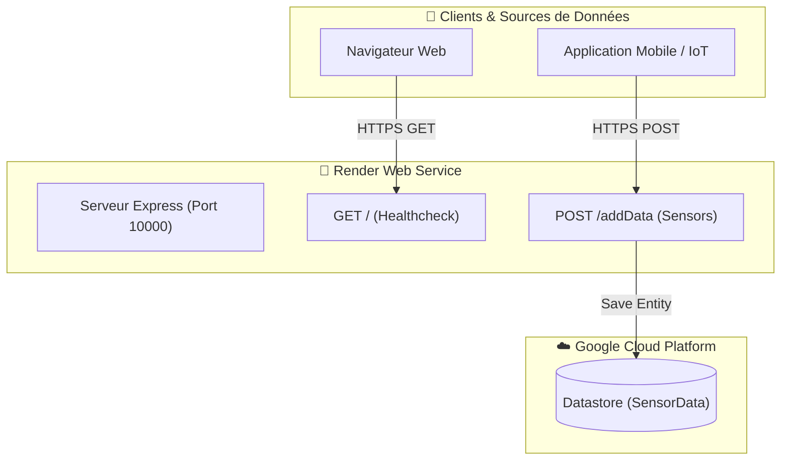

[](https://orcid.org/0009-0000-1250-8205)

# 🧊 OxyONE / SSCI Cloud Backend

Backend Node.js / Express déployé sur Render pour la collecte et la gestion des données de capteurs IoT de la chaîne du froid.

## 📐 Architecture du Système



## 🔌 API Endpoints

| Méthode | Endpoint | Description |
| :--- | :--- | :--- |
| `GET` | `/` | Healthcheck & statut de l'API |
| `GET` | `/helloWorld` | Test rapide de connectivité |
| `POST` | `/addData` | Enregistrement d'un relevé de température dans GCP Datastore |

## 🧪 Exemple de requête POST `/addData`

```bash
curl -X POST [https://backend-ssci-cloudrun.onrender.com/addData](https://backend-ssci-cloudrun.onrender.com/addData) \
  -H "Content-Type: application/json" \
  -d '{
    "sensor_id": "COLD-ROOM-01",
    "temperature": 3.8,
    "humidity": 85
  }'
```


## Déploiement GCP
Projet géré sur Google Cloud Shell ().
